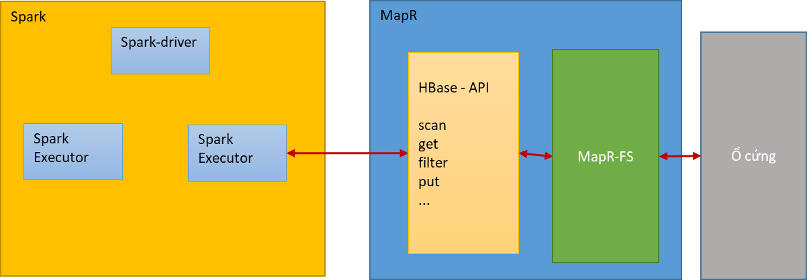

1.Mục đích sử dụng Spark - MapR		
		Mục đích sử dụng Spark - MapR là để tăng performance cho hệ thống bằng cách xử lý song song trên nhiều máy khác nhau.

2. Tổng quan kiến trúc được sử dụng trong dự án

		 - Spark : Thành phần xử lý code java.			
					Tham khảo sheet [spark]
		 - MapR: Thành phần đọc - ghi dữ liệu			
					Tham khảo sheet [MapR]

3. Thông số môi trường
OS				   			CentOS 7
Mapr-DB version:							5
Spark version							1.5.2
Scala version							10
YARN version							1
Zookeeper							3.4.5
